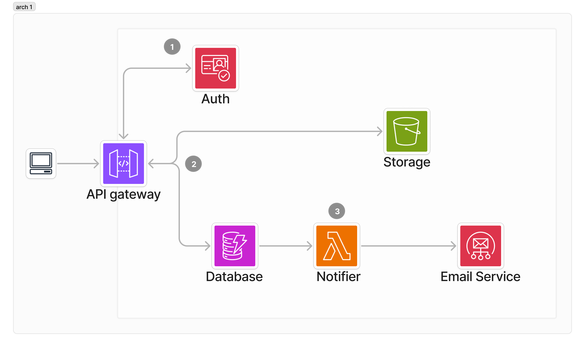

# JobJam - Serverless Hiring System

Welcome to the JobJam repository! JobJam is a serverless CMS built using AWS
services to streamline and improve the hiring process for a fictional company. This system
is designed to be scalable, cost-effective, and easy to integrate with their
existing frontend applications. For a detailed overview of the project, you can
view the notion page
[here](https://neighborly-airport-3a6.notion.site/Serverless-CMS-JamJob-v2-e6b87b25c4d84af8bd60b41e642be629?pvs=4)

## Table of Contents

1. [Overview](#overview)
2. [Features](#features)
3. [Tech Stack](#tech-stack)
4. [Architecture](#architecture)
5. [Setup Instructions](#setup-instructions)

## Overview

JobJam leverages AWS serverless services to provide a backend solution for
managing job applications. With a focus on scalability and cost-efficiency,
JobJam eliminates the need for managing servers, allowing your team to
concentrate on critical business processes.

## Features

- **Job Listings Management**: Create, update, and delete job listings.
- **Application Submission**: Applicants can submit their applications to job
  postings.
- **Application Review**: Hiring managers can review and manage applications.
- **Interview Scheduling**: Schedule and manage interviews with applicants.
- **Offer Management**: Manage job offers and notifications.
- **Role-Based Access Control**: Different roles (Applicant, Interviewer, Hiring
  Manager) with appropriate access levels.

## Tech Stack

- **AWS API Gateway**: REST API management.
- **AWS DynamoDB**: NoSQL database for storing job and application data.
- **AWS S3**: Storage for static assets.
- **AWS Cognito**: User authentication and authorization.
- **AWS SES**: Email notifications.
- **AWS CDK**: Infrastructure as Code for deploying AWS resources.

## Architecture

<!-- image -->



<!-- explanation -->

1. Cognito authenticates every request made via API gateway
2. Requests get transformed with VTLs based on the authentication and passed on
   to AWS services and the services can send data back to the user
3. On Certain DynamoDB changes, Lambda will notify users by using the emailing
   service

The architecture uses a single DynamoDB table with a composite primary key
(partition key and sort key) to efficiently manage the different entities within
the system. Below is a simplified overview of the architecture:

## Setup Instructions

### Prerequisites

- AWS CLI
- AWS CDK
- Node.js and npm

### Steps

1. **Clone the repository**:

   ```bash
   git clone https://github.com/JairJosafath/JobJam.git
   cd JobJam
   ```

2. **Install dependencies**:

   ```bash
   npm install
   ```

   You may also need to install packages for the authorizer lambda function:

   ```bash
   cd into the authorizer directory
   npm install
   ```

   I usually just put the specific file in the node_modules folder, because npm
   i adds a lot of unnecessary files.

3. **Configure AWS CLI**:

   I use AWS Identity center to configure my AWS CLI, you can use any way to do
   that. I have set my profile to build the project to jobjam_admin. And have
   scripts in npm to easily run cdk scripts. You can remove the --profile
   jobjam_admin if you want to use your default profile. you can replace it with
   your own profile too ofcourse.

   ```json
    "deploy-dev": "cdk deploy jobjamstack-dev --profile jobjam_admin",
    "deploy-prod": "cdk deploy jobjamstack-prod --profile jobjam_admin",

   ```

4. **Set up environment variables**: Create a `.env` file in the root directory
   and add the necessary configuration (e.g., Cognito User Pool ID, etc.). you
   can use the .env.example file as a template. You should set values for your testusers before running the deploy scripts.

5. **Deploy the infrastructure**:

   ```bash
   cdk deploy
   ```

   or

   ```bash
   npm run deploy-dev
   ```

6. **Run the test scripts**: You can run the test scripts manually or use the npm scripts to run them.

   ```bash
   npm run test-stack
   ```

   this just runs all the tests in the order so the integration tests can run. The test makes users, and the users mimic the roles of the system. The tests are in the test folder. You should be able to verify all changes made in the aws resources.
